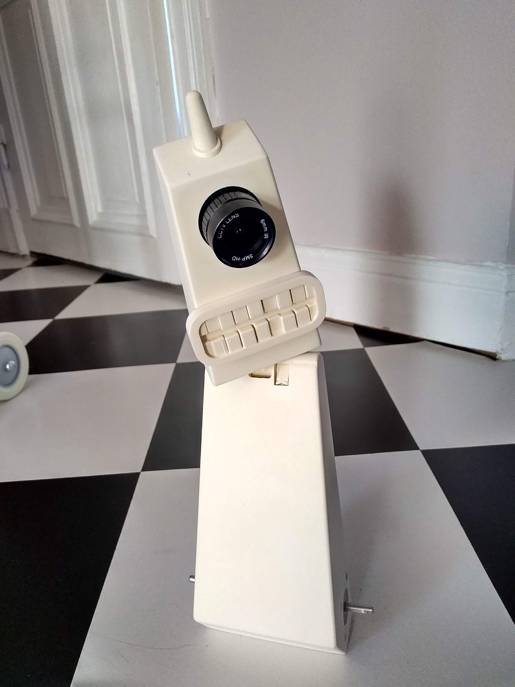

# RiktigPatrick

Self-balancing robot with a turning head, trained via reinforcement learning in MuJoCo simulation, with a backend-agnostic controller that can be swapped between simulator and physical robot.



## Goal

Train a balancing robot using RL to balance upright and respond to disturbances. The controller should be:
- **Backend-agnostic**: Swappable between MuJoCo simulation and physical robot
- **Robust**: Handle initial state randomization and perturbations

## Project Structure

```
RiktigPatrick/
├── src/sim/               # RL training in MuJoCo
│   ├── rl_rp.py          # Sequential RL training
│   ├── parallel_rl_rp.py  # Parallel RL training (faster)
│   ├── try_policy.py      # Test trained policy
│   ├── algos.py           # REINFORCE algorithm
│   ├── nets.py            # Neural network architectures
│   ├── config.yaml        # Centralized configuration
│   ├── sim_config.py      # Config loader
│   └── envs/rp_env.py     # MuJoCo environment
├── src/filters/           # Sensor filtering
│   ├── qutils.py          # Quaternion utilities
│   └── mahony.py          # AHRS filter
├── notes/                 # Setup notes
└── pyproject.toml         # Package config
```

## Setup

```bash
cd src/
uv venv --python 3.10 ../.venv
source ../.venv/bin/activate
uv pip install gymnasium mujoco dm-control torch numpy mlflow pandas
```

## Run Training

```bash
cd src/
export PYTHONPATH="$PWD:$PYTHONPATH"

# Set mlflow credentials (or source .env file)
export MLFLOW_TRACKING_URI=https://ml.twohands.dev
export MLFLOW_TRACKING_USERNAME=topiko
export MLFLOW_TRACKING_PASSWORD='your-password'

# Parallel training (recommended)
python parallel_rl_rp.py

# Sequential training (for debugging)
python rl_rp.py
```

## Test Policy

```bash
python try_policy.py --policy REINFORCE
python try_policy.py --policy pid
```

## Configuration

Edit `src/sim/config.yaml`:

| Section | Parameter | Description |
|---------|-----------|-------------|
| training | nrollouts | Number of parallel environments |
| training | max_episodes | Total training episodes |
| rl | learning_rate | Optimizer learning rate |
| rl | gamma | Discount factor |
| rl | init2zeros | If true, initialize stddev to 0.01; else ~0.5-1.0 |
| env | randomize | Enable initial state randomization |
| env | ctrl_mode | "vel" or "acc" control mode |
| reward | step | Survival reward per step |
| reward | pitch_coef | Penalty coefficient for pitch deviation |
| reward | yaw_coef | Penalty coefficient for yaw deviation |

## Reward Function

The reward encourages the robot to balance upright while minimizing energy:

```
reward = step_reward - pitch_coef * |pitch| - yaw_coef * |yaw| - action_coef * |action|
```

The episode terminates when |pitch| > 20 degrees.

## State Space

Model input (6 dims):
- Filtered roll/pitch (from AHRS)
- Gyroscope (3-axis)
- Left wheel velocity
- Right wheel velocity

## Randomization

When `randomize: true`:
- Initial pitch: Gaussian (μ=0, σ=2°)
- Initial wheel velocity: Gaussian (μ=0, σ=1 rad/s) - both wheels same velocity

This helps the policy generalize to different starting conditions.

## Known Issues

- Training tends to plateau around ~50 return - may need hyperparameter tuning
- High value loss indicates critic may need separate learning rate
